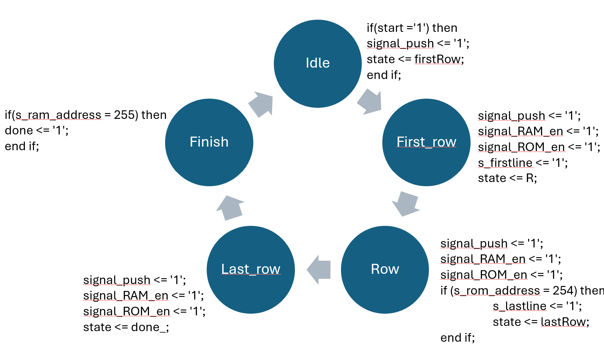

# FPGA-Based Salt & Pepper Noise Filter

## Overview
This project implements an **FPGA-based digital image filter** for removing **Salt & Pepper noise** using the **Median of Medians algorithm**. The implementation runs on an **Altera FPGA**, with an efficient hardware design for real-time processing.

<h3 align="center">Before & After Filtering</h3>

  
     
    <b>Before</b>
  
  ➜
  
     
    <b>After</b>
  

## Features
- **Removes up to 5% of Salt & Pepper noise** from images.
- **Processes 256x256 pixel images** with a reduced color depth of **5 bits per pixel** (instead of 24-bit RGB).
- **Operates at a minimum frequency of 50MHz**.
- **Implements a Median of Medians filtering approach** for enhanced noise removal.
- **Uses FSM (Finite State Machine) for control flow**.
- **RAM/ROM integration** for optimized memory access.

## How It Works
### **1. Image Processing Pipeline:**
- The noisy image is loaded into **ROM**.
- The image is transferred to a **buffer of 3 rows**, each of size **258 pixels** (256 + 2 pixels for padding).
- A **3x3 median of median filter** is applied in parallel across the entire row.
- The filtered pixels are written to **RAM**.
- The next row is loaded from **ROM**, and the process continues until the entire image is filtered.

### **2. FSM (Finite State Machine) Control:**
- Controls the **start**, **processing**, and **completion** of filtering.
- Uses **RAM/ROM signals** for memory management.
- Manages state transitions for efficient row processing.
  
   

   

